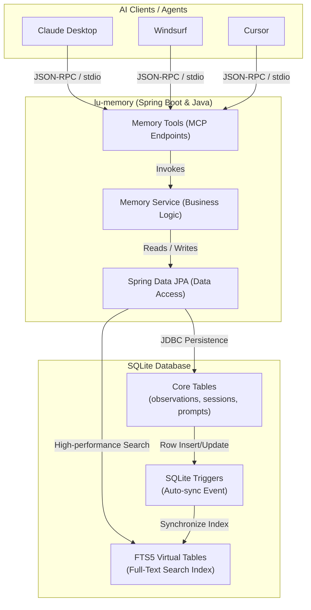

# 🧠 lu-memory - MCP Memory Server


**lu-memory** is a robust, lightweight **Model Context Protocol (MCP)** server built with **Java 25** and **Spring Boot**. It acts as an external persistent memory service, allowing AI assistants and agents to build and maintain long-term context across multiple sessions, document architectural decisions, log bugs, and store structured observations seamlessly.

---

## 🚀 Features & Capabilities

- **Session Management**: Explicitly start and end logical chat sessions, keeping a clean timeline of tasks and comprehensive summaries.
- **Categorized Observations**: Save memories by granular types: `DECISION`, `BUGFIX`, `PATTERN`, `NOTE`, `ARCHITECTURE`, `SUMMARY`, and `DOCUMENTATION`.
- **Full-Text Context Recovery**: Powered by SQLite FTS5 (Full-Text Search), instantly retrieve chronological timelines around past observations.
- **Advanced Search & Filtering**: High-performance BM25 ranking and result highlighting for deep context retrieval, supplemented by precise tag-based filtering.
- **Topic, Tag & Importance Tracking**: Group related memories by dynamic, evolving "topics" with stable topic keys, assign `HIGH`, `MEDIUM`, or `LOW` importance levels, and use custom tags for high search precision.
- **Deduplication & Revision Tracking**: Automatically handles content deduplication by hashing (`SHA-256`) and tracks revision counts.
- **Prompt Templating**: Save reusable instructional prompts as templates via `mem_save_prompt`.
- **Multi-Tenant / Scopes**: Differentiate local project memory from personal/global memory scopes.

## 🏗️ Architecture & Design Principles

The application is structured as a **Modular Monolith** applying **Clean Architecture** patterns, ensuring high extensibility and testability.

- **CQRS (Command Query Responsibility Segregation)**: Writes (observations, session states) are handled defensively with complete state updates, while Reads leverage highly optimized SQLite FTS5 indices for high-performance retrieval and timeline sequencing.
- **SOLID Principles**:
  - _Single Responsibility Principle (SRP)_: Each domain entity (Session, Observation, Prompt) has designated repositories. The `MemoryTools` class bridges MCP boundaries while relying entirely on `MemoryService` for business logic.
  - _Open/Closed Principle (OCP)_: The search capabilities gracefully fall back to LIKE-based SQL patterns if FTS5 is not available.
  - _Dependency Inversion Principle (DIP)_: Services rely strictly on Data Access abstractions (Spring Data JPA) to decouple business logic from the SQLite dialect.
- **Event-Driven Resilience**: Leveraging SQLite Triggers allows immediate synchronization between atomic observation tables and their associated FTS5 virtual indexing without polluting the application layer with dual-write concerns.

### 📊 System Architecture



## 🛠 Tech Stack

- **Core & Runtime**: Java 25
- **Framework & MCP Integration**: Spring Boot 4.x, Spring AI (`spring-ai-starter-mcp-server` 2.0.0-M2)
- **Persistence**: SQLite (via `sqlite-jdbc` 3.45.1.0 and `spring-boot-starter-data-jpa`)
- **Build System**: Maven Wrapper (`mvnw`)

---

## 📦 Getting Started

### Prerequisites

- **Java JDK 25** or higher configured in your environment.
- **Maven** (optional, as the repository includes `mvnw`).
- **SQLite 3** installed and available in your environment.

### Installation & Execution

1. Clone this repository and navigate to the root directory.
2. **Initialize the SQLite database** by executing the provided schema script (which configures the FTS5 virtual tables):

```bash
sqlite3 lu-memory.db < create-tables.sql
```

3. Start the application using the Maven wrapper:

```bash
# On Linux / macOS
./mvnw spring-boot:run

# On Windows
mvnw.cmd spring-boot:run
```

### MCP Client Configuration

To expose `lu-memory` to your AI client (e.g., Claude Desktop, Windsurf, or Cursor), add the server definition to your `mcp_config.json`:

```json
{
  "lu-memory": {
    "command": "{path_to_jdk}\\bin\\java.exe",
    "args": [
      "--enable-native-access=ALL-UNNAMED",
      "-Dspring.ai.mcp.server.stdio=true",
      "-Dspring.main.web-application-type=none",
      "-DLOG_FILE={path_to_project}\\mcp-lu-memory.log",
      "-DDB_URL=jdbc:sqlite:{path_to_project}\\lu-memory.db",
      "-jar",
      "{path_to_project}\\target\\lu-memory-0.0.1-SNAPSHOT.jar"
    ],
    "disabled": false
  }
}
```

_(Adjust the path to your compiled `.jar` and Java runtime executable accordingly)._

---

## 🧰 Available MCP Tools Reference

The server directly provides these 17 tools via MCP. Agents should leverage them based on the standard **Memory Protocol**:

| Capability Area        | Tool Name                    | Description & Usage                                                                                                                    |
| ---------------------- | ---------------------------- | -------------------------------------------------------------------------------------------------------------------------------------- |
| **Session Control**    | `mem_session_start`          | Opens a new session with an `agentName` (e.g., "Windsurf") and `branchName`.                                                           |
|                        | `mem_session_end`            | Closes an ongoing session. Requires a `status` (`COMPLETED`, `ABORTED`, `FAILED`).                                                     |
|                        | `mem_session_summary`        | Saves an end-of-session summary reflecting what was accomplished.                                                                      |
| **Memory Extraction**  | `mem_context`                | Fetches the most recent context from previous sessions natively upon boot/reset.                                                       |
|                        | `mem_context_scoped`         | Fetches recent context constrained by `scope` and `projectKey` for better tenant/project isolation.                                    |
|                        | `mem_timeline`               | Retrieves a chronological timeline around a specific observation.                                                                      |
|                        | `mem_get_observation`        | Expands and returns the full content payload of a specific memory ID.                                                                  |
| **Observation Mgmt**   | `mem_save`                   | Saves grouped observations. Requires `type`, `topicKey`, `title`, `content`, `tags`, `projectName`, `importanceLevel` and `sessionId`. |
|                        | `mem_save_prompt`            | Saves user-specific prompts as templates. Requires `intent` and `source`.                                                              |
|                        | `mem_update`                 | Revises an existing observation. Supports updating `importanceLevel` and `tags`.                                                       |
|                        | `mem_delete`                 | Performs a soft-delete (or hard-delete flag) of an observation.                                                                        |
| **Search & Discovery** | `mem_suggest_topic_key`      | Derives a stable SEO-friendly key for evolving topics.                                                                                 |
|                        | `mem_search`                 | Standard Full-Text Search across the datastore applying SQLite FTS5. Supports filtering by `tags`.                                     |
|                        | `mem_search_scoped`          | Full-Text Search with explicit `scope` and `projectKey` filtering.                                                                     |
|                        | `mem_search_advanced`        | Advanced FTS query mechanism returning highlighted insights and BM25 ranked scoring. Supports filtering by `tags`.                     |
|                        | `mem_search_advanced_scoped` | Advanced FTS query with explicit `scope` and `projectKey` filtering plus highlights/ranking.                                           |
| **System Info**        | `mem_stats`                  | Outputs global diagnostic statistics such as row counts, active topics, and duplicates.                                                |

---

## 📖 Memory Protocol for Agents

Agents interacting with this server **MUST** follow this protocol to maximize consistency:

1. **Context Recovery**: Invoke `mem_context` immediately at the start of a session or after any context reset.
2. **Lifecycle Management**: Start work with `mem_session_start` and strictly finalize interactions using `mem_session_summary` alongside `mem_session_end`.
3. **Proactive Saves**: Autonomously leverage `mem_save` for consequential architecture decisions, bug resolutions, and configuration updates.
4. **Topic Continuity**: For long-spanning concepts, fetch a consistent topic with `mem_suggest_topic_key` and group observations beneath it.
5. **Drill-Down Context**: Use the 3-layer drill-down pattern: `mem_search` -> `mem_timeline` -> `mem_get_observation`.

### 📝 Formatted Memory Taxonomy

When committing large or architectural content via `mem_save`, utilize the following required Markdown schema within the content payload:

```markdown
**What**: [Summarized action, bug, or decision]
**Why**: [Domain or technical justification; problems solved]
**Where**: [Modified files, architecture sectors, tools]
**Key Details**:

- [Critical Implementation detail 1]
- [Critical Implementation detail 2]

**Learned**: [Important insights preventing future friction]

_(Note: Always specify an appropriate `importanceLevel` (HIGH, MEDIUM, LOW) and relevant `tags` to make these observations easily retrievable)._
```

---

## � Agent Usage Rules

For agents using lu-memory, the complete usage rules and examples are located in:

- **`.agents\rules\lu-memory.md`** - Main rule file for agents
- **`.windsurf\rules\lu-memory.md`** - Windsurf-specific rule file (if exists)

These files contain:

- Session lifecycle protocols (mandatory start/end procedures)
- Memory format conventions (What/Why/Where structure)
- Complete workflow examples
- Best practices for saving observations and prompts
- Advanced search and timeline usage patterns

**⚠️ Important**: Agents MUST follow the rules in these files to ensure proper memory management and session handling.

---

## �📚 Further Reading

- [Security Policy](SECURITY.md): Guidelines and vulnerability reporting.
- [Help Document](HELP.md): Extended application resources and operations.
- [Changelog](CHANGELOG.md): History of feature updates.
- [Contributing](CONTRIBUTING.adoc): Rules and guide to help code logic directly.
- [Code of Conduct](CODE_OF_CONDUCT.md): Project collaboration standard.
